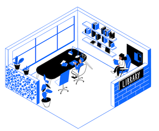
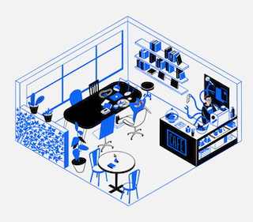

# Gregory Alexandre - al-X Le MEsTRE

## 🚀 Creative Technologist | 💻 Web Designer & Developer

👋 **Salut! I'm Gregory** — A bridge between the narratives of our cultures and the binary world of coding. From the heart of Port-au-Prince to the bustling streets of New York and the diverse ambiance of Montreal, I blend storytelling with technology to create immersive, user-centric digital experiences.

---

## 🌐 About Me

Multilingual in both human and programming languages, I navigate through the realms of customer service and front-end web development. I'm an artisan at the keyboard, crafting experiences that resonate both visually and functionally.

- **Location**: Brooklyn, NYC, USA
- **Phone**: [(678)-467-9646](tel:+16784679646)
- **Email**: [gregoryalexandre369@gmail.com](mailto:gregoryalexandre369@gmail.com)

---

## 💼 Professional Journey

With a palette comprising HTML5, CSS3, JavaScript, React, and a flair for UI/UX design, I am currently honing my skills through an intensive Full Stack Software Engineer Bootcamp. My approach integrates open-source philosophy with the brushstrokes of the arts.

- **Current Role**: Web Development Trainee at TripleTen
- **Interests**: Synchronicity in code, AI applications, Singularity contemplation

---

## 🎨 Poetically Blogging

Join me as I explore the musings and prose of al-X. Each blog post is a reflection of the depth found at the intersection of art and code.

---

## Technical Toolbox

- 💻 **Front-End Development:** HTML5, CSS3, JavaScript, React.
- 🧰 **UI/UX Design & Illustration:** Figma, Adobe Suite (Photoshop, Illustrator, XD).
- 🖥️ **IDE Skills:** Proficient in Visual Studio Code.
- 🤖 **Artificial Intelligence:** Exploring ChatGPT, OpenAI integrations, Bard and Gemini.
- 📚 **Version Control:** Skilled in Git and GitHub.
- 🌟 **Hospitality Skills:** Applying customer service excellence to UX.
- 🔄 **Methodologies:** Agile and design thinking for adaptive, quality output.

---

## 📚 Highlighted Projects

![Project Screenshot]

  

---

| Project Screenshot                                                                                      | Project                                                                                                                                  |
| ------------------------------------------------------------------------------------------------------- | ---------------------------------------------------------------------------------------------------------------------------------------- |
|      | **[Triple Ten Library](https://al-xlemestre.github.io/Library/)**: A digital library interface with semantic HTML5 and CSS Flexbox.      |
|  | **[Triple Ten Coffee Shop](https://al-xlemestre.github.io/Coffee_Shop/)**: An engaging coffee shop website with advanced CSS techniques. |
|                | **[Around The US](https://al-xlemestre.github.io/Arround-The-US/)**: An interactive journey through the U.S. landscapes.                 |

---

## 🎓 Education

**Full Stack Software Engineer Bootcamp**

- Expanding my knowledge in full-stack technologies, including back-end systems and databases.

---

## 📊 GitHub Stats

---

## 🌐 Languages Proficiency

- 🇭🇹 Haitian Creole: Native
- 🇫🇷 French: Native
- 🇺🇸 English: Full Professional Proficiency
- 🇪🇸 Spanish: Limited Working Proficiency
- 🇸🇦 Arabic (MSA): Basic Understanding, Reading, and Writing; Knowledge of Tajweed Rules

---

## 📬 Contact Me

I am always on the lookout for exciting freelance projects that challenge my skills and push the boundaries of web design and development. If you're seeking a dedicated, creative professional to bring your vision to life or to collaborate on a project that benefits from my unique blend of artistic sensibility and technical prowess, I'd love to hear from you.

Whether you're in search of a bespoke website design or an engaging app, my inbox is open for collaborations and exciting opportunities.

- [LinkedIn](https://www.linkedin.com/in/gregoryalexandre369/)
- [GitHub](https://github.com/al-XLeMEsTRE)
- [Twitter](https://twitter.com/al_XLeMEsTRE)
- [Instagram](https://instagram.com/al_x_lemestre)
- [CodePen](https://codepen.io/al-XLeMEsTRE)
- [Twitch](https://www.twitch.tv/gregoryalexandre369)

---
