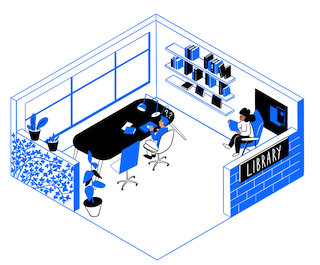
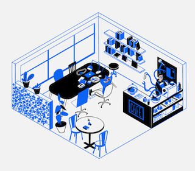

## About Me

I'm a software developer and multidisciplinary designer passionate about
creating thoughtful digital products.

My background combines design, technology and storytelling, allowing me
to approach software from both an engineering and user experience
perspective.

Currently focused on:

- Frontend Development
- JavaScript
- UI Engineering
- Git & GitHub
- Responsive Design
- AI Workflows
---

## 🌍 About Me

# Software Developer • Creative Technologist • Founder of Duality Solutions

I'm a software developer with a multidisciplinary background in design, branding, and digital experiences. I enjoy building responsive websites, intuitive user interfaces, and modern web applications that combine clean engineering with thoughtful design.

Currently focused on expanding my expertise in JavaScript, React, backend development, and AI-assisted software engineering while building projects that strengthen both my technical skills and creative vision.

- 📍 **Location:** Manhattan, Kansas, USA
- 💼 **Open to:** Software Engineering Internships & Freelance Opportunities
- 🌱 **Currently Learning:** JavaScript • React • Node.js • Full-Stack Development
---

## 🌐 Languages Proficiency

- 🇭🇹 Haitian Creole: Native
- 🇫🇷 French: Native
- 🇺🇸 English: Full Professional Proficiency
- 🇪🇸 Spanish: Limited Working Proficiency
- 🇸🇦 Arabic (MSA): Basic Understanding, Reading, and Writing; Knowledge of Tajweed Rules

---

## 💻 Tech Stack

| Languages | Frontend | Design | Tools | Learning |
|-----------|----------|--------|-------|----------|
| HTML5 | Bootstrap | Figma | VS Code | React |
| CSS3 | Tailwind CSS | Photoshop | Git | Node.js |
| JavaScript | Responsive Design | Illustrator | GitHub | Express |
| | | | ChatGPT | MongoDB |
## 📚 Highlighted Projects

![Profile Screenshot]

  

---

| Project Screenshot                                                                                      | Project                                                                                                                                  |
| ------------------------------------------------------------------------------------------------------- | ---------------------------------------------------------------------------------------------------------------------------------------- |
|      | **[Triple Ten Library](https://al-xlemestre.github.io/Library/)**: A digital library interface with semantic HTML5 and CSS Flexbox.      |
|  | **[Triple Ten Coffee Shop](https://al-xlemestre.github.io/Coffee_Shop/)**: An engaging coffee shop website with advanced CSS techniques. |
|                | **[Around The US](https://al-xlemestre.github.io/Arround-The-US/)**: An interactive journey through the U.S. landscapes.                 |

---
## 🚀 Featured Projects

<table>
<tr>

<td width="33%">

### ☕ Coffee Shop

Responsive landing page built with HTML & CSS.

**Tech**
- HTML5
- CSS3
- Flexbox

🔗 [Live Demo](https://al-xlemestre.github.io/Coffee_Shop/)

</td>

<td width="33%">

### 📚 Library

Semantic HTML digital library interface.

**Tech**
- HTML5
- CSS Grid
- Flexbox

🔗 [Live Demo](https://al-xlemestre.github.io/Library/)

</td>

<td width="33%">

### 🇺🇸 Around the US

Interactive responsive gallery.

**Tech**
- HTML
- CSS
- JavaScript

🔗 [Live Demo](https://al-xlemestre.github.io/Arround-The-US/)

</td>

</tr>
</table>
---

## 📊 GitHub Analytics

  

  

  

---

## 🤝 Let's Connect

  <i>Building thoughtful digital experiences through design, code, and systems.</i>

